## Graphical Models

Graphical models provide a way to represent the conditional dependencies 
between a number of random variables. They provide a visual way of representing 
the joint distribution of the entire set of RVs.

<span class='red'>Components:</span>
- Vertices: random variables
- Edges: condition dependencies between RVs

<span class='red'>Types:</span>
- Directed: `Bayesian networks` (causal relationships)
- Undirected: `Markov random fields` / `Markov networks`

See [The Elements of Statistical Learning (ESM)](http://www-stat.stanford.edu/~tibs/ElemStatLearn/)
chapter 17 for an overview of undirected graphical models.

---

## Graphical Models

Constructing graphical models from data:

* <span class='blue2'>Model selection</span>: choosing the structure of the 
  graph.
* <span class='blue2'>Learning</span>: Estimating edge weights from data.

<div class='source'>ESL p626</div>

```{r pgm_example, echo=FALSE}
library(igraph)
x = matrix(0, 5, 5)
x[1, 2] = x[1,3] = x[1,4] = x[2, 4] = x[2, 5] = x[1,5] = x[3,5] = 1
plot(graph.adjacency(x, mode='undirected'))
```
---

## Undirected Graphical Models

### Gaussian Graphical Models
- Assume that the observations have a multivariate Gaussian distribution with
mean $\mu$ and covariance matrix $\Sigma$.

- The <span class='blue'>inverse covariance matrix</span> 
  $\Theta = \Sigma^{-1}$ (aka concentration matrix or precision matrix) 
  contains information about the <span class='blue'>partial covariances</span> 
  between each pair of nodes conditioned on all other variables (ESL.)

- If the $ij$th component of $\Theta$ is zero, then variables $i$ and $j$ are
  conditionally independent, given the other variables.
- This is not necessarily true, however, if data is not MV gaussian! (see
  talk linked to at end of presentation.)

### Covariance graphs

- In covariance graphs or relevance networks, edges are present when the
<span class='blue'>covariance</span> is non-zero.

---

## Sparse Graphical Models

>- In some cases, you expect that the underlying data should be sparse.
>- Want to only keep significant edges.
>- An $L_1$ penalty on the estimation of $\Sigma^{-1}$ can be used to induce 
   sparseness.

---.segue .dark

## Cell Signaling

---

## Cell signaling

The basic goal of cell signaling to provide a mechanism for cells to respond
convey a message from one part of a cell to another.

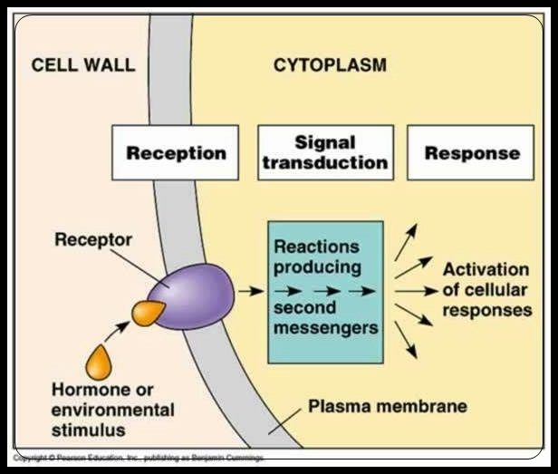
<div class='source'>http://commons.wikimedia.org/wiki/File:1Signal_Transduction_Pathways_Model.jpg</div>

---

## Cell signaling

### Examples of cell signaling

- Cell to cell communication (e.g. quorum sensing)
- Responding to host (or pathogen) molecules
- Respond to external physiological, nutrient, etc. conditions
- Chemotaxis (movement)

---

## Cell signaling

### Cell membrane

Cell signaling often begins at the cell membrane ("Signal transduction").
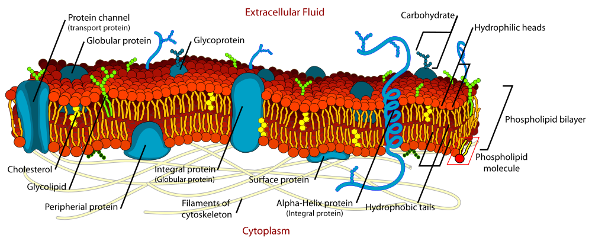
<div class='source'>Source: http://en.wikipedia.org/wiki/File:Cell_membrane_detailed_diagram_en.svg</div>

---

## Cell signaling

### Lipid rafts
Lipid rafts help to bring together components that function together for a
particular signaling pathway: receptors, co-receptors, etc.

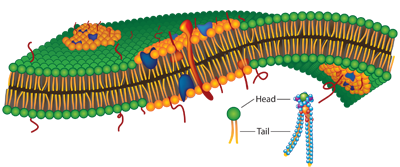
<div class='source'>source: http://www.lanl.gov/science/1663/august2011/story3full.shtml</div>

---

## Cell signalling network

It's not quite a 1:1 process...
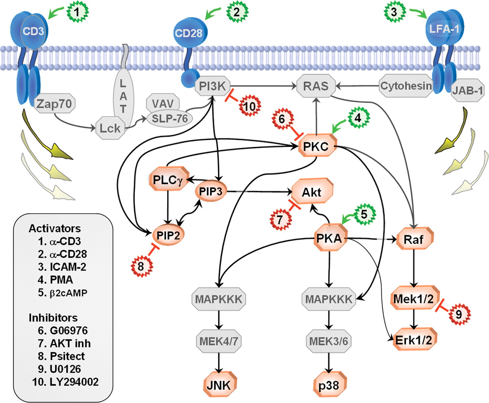
<div class='source'>Sachs 2003; Figure 2</div>

---

## Cell signalling network

Figure 1A: Network inference using flow cytometry data (Sachs et al 2005)
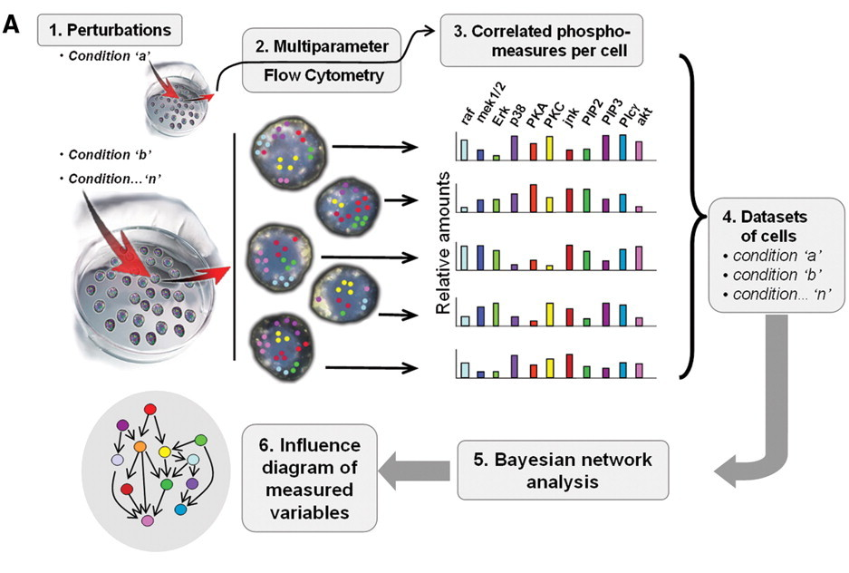

---.segue .dark

## Flow Cytometry

---

## Flow Cytometry

Flow cytometry a high-throughput single-cell method that is generally
used for one of two things:

1. Counting cells
2. Sorting cells

However, it can also be used to measure many other properties of cells
(expression, morphology, enzymatic activity, etc.)

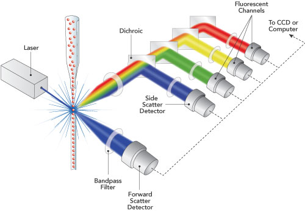
<div class='source'>http://www.semrock.com/flow-cytometry.aspx</div>

---

## Flow Cytometry

- Molecules of interest (e.g. proteins involved in a signaling cascade) are 
"tagged" with an antibody containing a fluorescent protein.
- By using different fluorescent proteins (each of which emits at a different
  wavelength) multiple proteins can be bound and measured simultaneously.

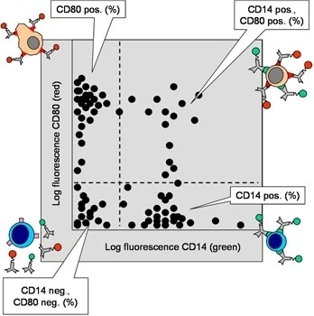
<div class='source'>http://www.antibodies-online.com/resources/17/1247/What+is+flow+cytometry+FACS+analysis/</div>

---

## Flow Cytometry

### Multicolor Flow Cytometry

- Advantages
    1. Quantitative
    2. Can interrogate levels of multiple molecules at the same time
    3. Processes many individual cells (large $n$)
- Disadvantages
    1. Spectral overlap
    2. Variable brightness of fluorochromes

---

## Flow Cytometry

### Spectral Overlap

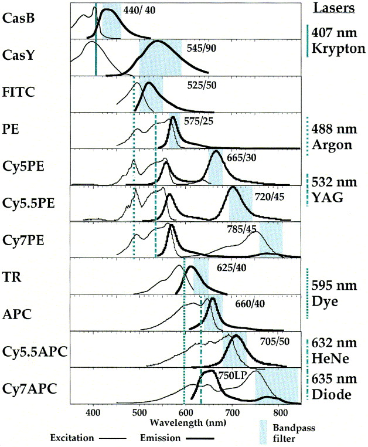
<div class='source'>Baumgarth and Roederer, 2000</div>

---

## Cell signalling network

Figure 1B-C: Network inference using flow cytometry data (Sachs et al 2005)
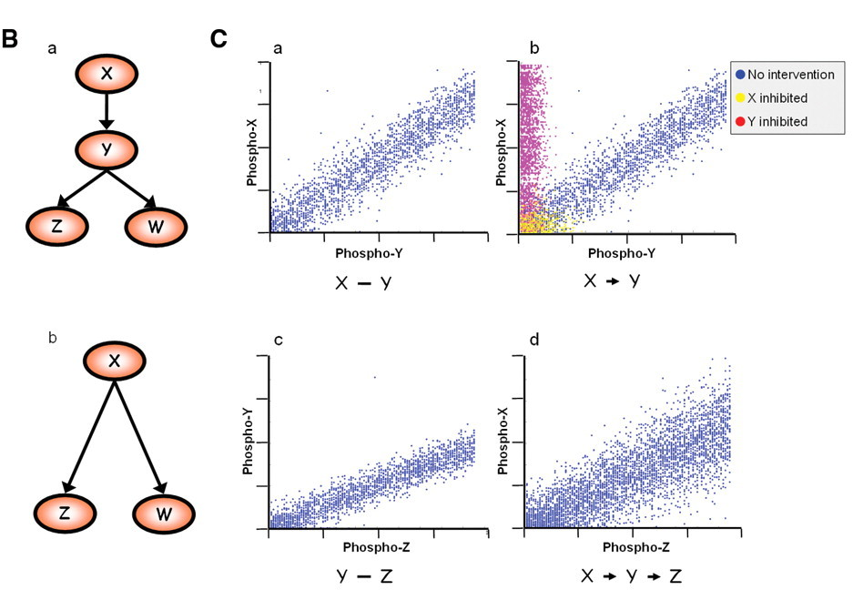

---.segue .dark

## Previous Work on Using the Lasso for Sparse Graphical Models

---

## Meinshausen and Bühlmann (2006)

>- Which components of $\Sigma^{-1}$ are non-zero?
>- Fit a lasso regression for each variable using all other variables as
   predictors.
>- Considered nonzero if $\Sigma^{-1}_{ij} \neq 0$ AND/OR 
   $\Sigma^{-1}_{ji} \neq 0$
>- Shown asymptotically to find nonzero components

---

## Exact solutions

Other authors have suggested exact solutions:

- Yuan & Lin (2007)
- Banerjee et al. (2007)
- Dahl et al. (2007)

[Interior point optimization](http://en.wikipedia.org/wiki/Interior_point_method)
is used to determine an exact maximiation.

---

## Graphical Lasso

- Exact solution based on coordinate descent approach in Banerjee et al. (2007)

<span class='red' style='font-weight: 700;'>Approach</span>

>- $N$ observations, $x_i, i=1,\ldots,N$ with dimension $p$, mean $\mu$ and 
   covariance $\Sigma$
>- let $\Theta = \Sigma^{-1}$ and let $S$ be the <span class='blue'>empirical
   covariance matrix</span>:
    $$S = \frac{1}{N} \sum_{i=1}^N (x_i - \overline{x})(x_i - \overline{x})^T$$
>- <span class='blue'>Goal:</span> Maximize the log-likelihood
    $$\text{log det} \Theta - \text{tr}(S\Theta) - \rho\Vert \Theta \Vert_1$$
   over non-negative definite matrices $\Theta$.
>- Above expression is the "Gaussian log-likelihood of the data, partially
   maximized with respect to the mean parameter $\mu$.

--- .segue .dark

## An interesting methods discussion...

---

## Algorithm (Friedman et al. 2007):

1. Start with $W = S + \rho I$. The diagonal of $W$ remains unchanged in what
follows.
2. For each $j = 1,2,\ldots p,1,2,\ldots p,\ldots,$ solve the lasso problem:
<span class='blue'>
    $$ min_\beta \{ \frac{1}{2} \Vert W^{1/2}_{11} \beta - b\Vert^2 + \rho \Vert \beta \Vert_1 \}$$
</span>
   where $b = W^{-1/2}_{11} s_{12}$, which takes as input the inner products 
  $W_{11}$ and $s_{12}$.  This gives a $p -1$ vector solution $\hat{\beta}$. 
  Fill in the corresponding row and column $W$ using $w_{12} = W_{11} \hat{\beta}$.
3. Continue to convergence.

In `glasso`, the procedure stops when the average absolute change in $W$ is
less than $t \cdot  \text{ave} |S^{-\text{diag}}|$ where $S^{-\text{diag}}$ are
the off-diagonal elements of the empirical coveriance matrix $S$ and $t$ is
a fixed threshold, set by default at 0.001.

--- .segue .dark

## An interesting algorithm discussion...

---.segue .dark

## Performance of Graphical Lasso

---

## Performance

- Simulated data for sparse and dense scenarios:
- <span class='blue'>Sparse</span>
  *  $(\Sigma^{-1})_{ii} = 1$, 
  * $(\Sigma^{-1})_{i,i-1} = (\Sigma^{-1})_{i-1,i} = 0.5$
  * 0 otherwise

- <span class='blue'>Dense</span>
  * $(\Sigma^{-1})_{ii} = 2$,
  * $(\Sigma^{-1})_{ii'} = 1$ otherwise

- Compared performance to `COVSEL` method from Banerjee et al. (2007).

- <span class='red'>Result</span>: Graphical lasso is 30-4000 times faster than
COVSEL and 2-10 slower than the approximate method.

- Even for dense problems, finishes in ~1min for p=1000 features. (Hard to tell
 from graph how it will scale to many more features, however).

---

## Performance


---.segue .dark

## How does the graphical lasso perform on real-world data?

---

## Cell signalling network

To demonstrate the usefulness of the graphical lasso on real-world problems,
the method is applied to cytometry data from Sachs et al. (2003)

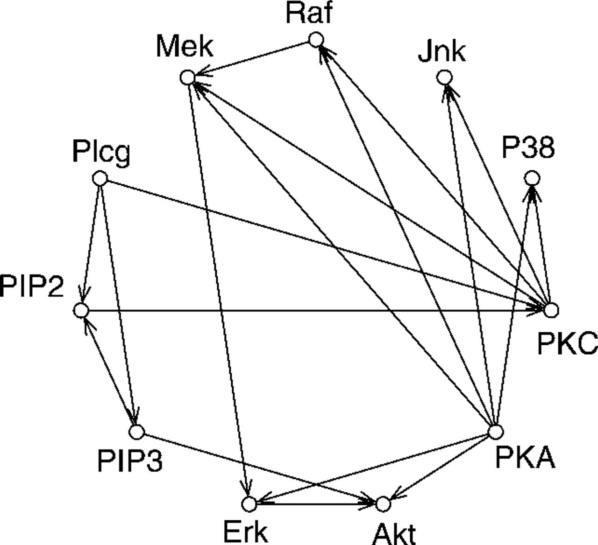

Figure 2: Original network derived in Sachs et al.
- $p$ = 11 proteins
- $n$ = 7466 cells

---

## Cell signalling network

Same network, but from the original Sachs et al. paper: better biological 
interpretation.

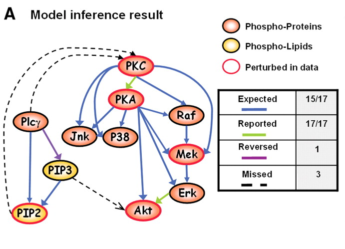
<div class='source'>Sachs et al. 2005</div>

---

## Cell signalling network

Figure 3: Undirected graphs generated using graphical lasso with various settings for
the regularization parameter, $\rho$. 
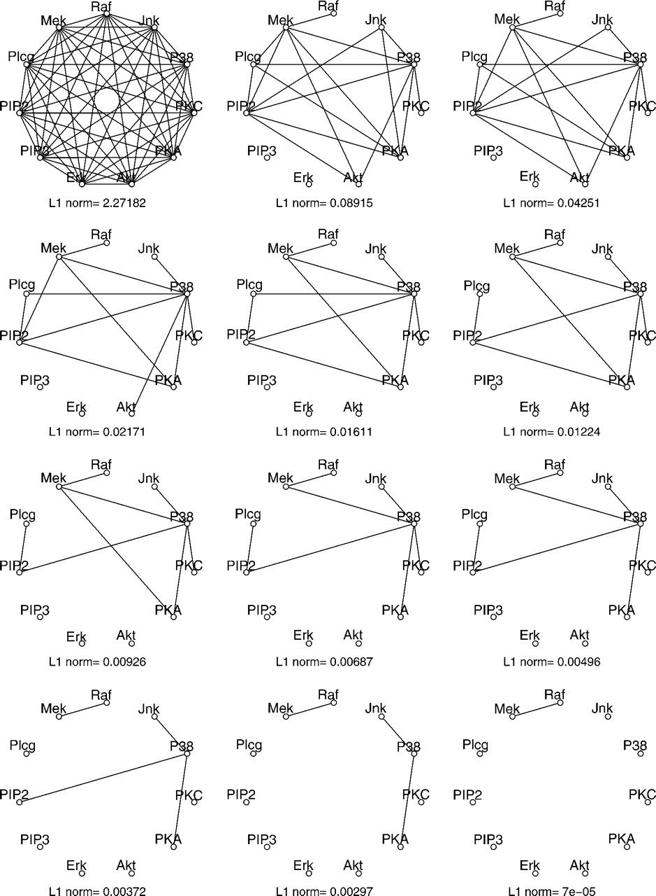

---

## Cell signalling network

Figure 4: Profile of coefficients as the total $L_1$ norm of the coefficient
vector increases and $\rho$ decreases. (The density of network increases as 
$L_1$ increases.)

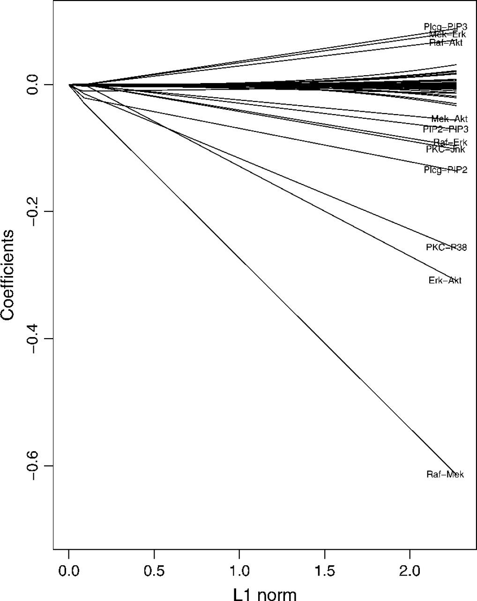

---

## Cell signalling network

Figure 5: LHS - tenfold cross-validation. RHS - regression sum of squares of
the exact graphical lasso vs. Meinhausen-Buhlmann approximation.

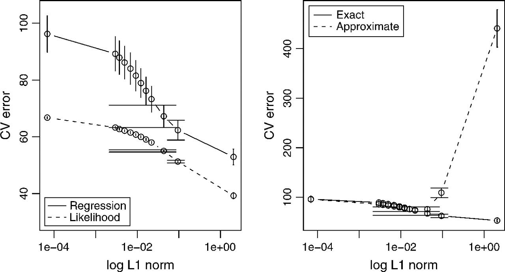

--- .segue .dark

## Summary

---

## Summary

1. Friedmann et al. present a fast $L_1$ penalized approach for inducing
sparsity in graphical models.
2. Builds on previous methods, starting with the blockwise coordinate descent
approach from Banerjee et al. (2007.)
3. Method arrives at at exact result and performs significantly faster
than previous methods.
4. When tested on real data, however, model provides only an approximation
and fails to predict many of the actual edge conditions.
5. Free implementation of the graphical lasso written in fortran and R is
available: `glasso`.

---

## More info

For a more recent (Dec 2012) discussion on this problem, check out this Neural
Information Processing (NIPS) talk by Po-Ling Loh:

<a href='http://videolectures.net/nips2012_loh_estimation/'>
    <br/>
    No voodoo here! Learning discrete graphical models via inverse covariance estimation
</a><br/>

--- .references

## References

```{r refs, include=FALSE}
library(knitcitations)
cleanbib()
citep("10.1093/biostatistics/kxm045")
citep("10.1126/science.1105809")
citep('10.1214/009053606000000281')
citep('10.1016/S0022-1759(00)00229-5')
citep(bibentry(
    bibtype   ='Book',
    author    = c(person('Hastie', 'Trevor', role='aut')),
    title     = "The elements of statistical learning data mining, inference, and prediction",
    publisher = "Springer",
    year      = "2009",
    address   = "New York",
    isbn      = "978-0387848570"
))

```

```{r refs_output, echo=FALSE, results='asis'}
bibliography('html')
```

---

## System info

```{r sysinfo}
sessionInfo()
```

<!-- Custom JavaScript -->
<script src="http://ajax.aspnetcdn.com/ajax/jQuery/jquery-1.7.min.js"></script>
<script type='text/javascript'>
$(function() {
    $("p:has(img)").addClass('centered');
});
</script>


