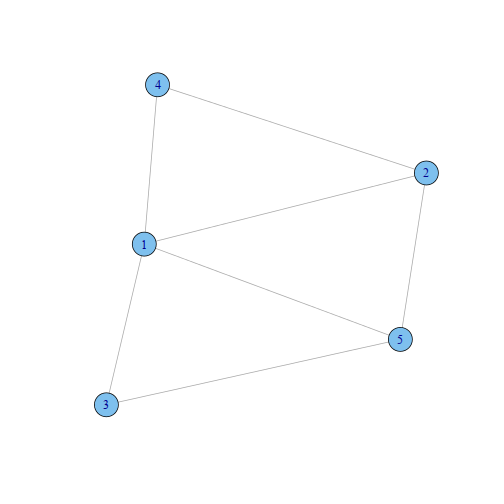

## Graphical Models

Graphical models provide ... to represent the conditional dependencies between
a number of random variables. They provide a visual way of representing the
joint distribution of the entire set of RVs (Hastie et al, 2009.)

Components
- Vertices random variables
- Edges missing edges imply condition independence

---

## Graphical Models

* Model selection choosing the structure of the graph.
* Learning Estimating edge weights from data.

 

